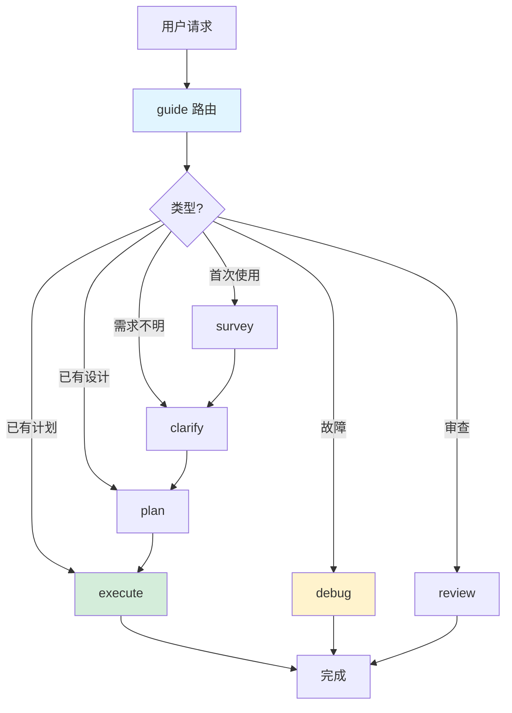

# Coding Skills

极简 coding agent 技能集,专注清晰流程和本地化开发。基于 Superpowers 和 Matt Pocock Skills 提炼。

**核心原则**: 完全本地化开发,不依赖 issue tracker (GitHub/Linear/Jira)。所有设计、计划、任务管理使用本地文件。

## 快速开始

安装后,在项目中执行:

```bash
# 1. 勘察项目(首次使用,或项目事实过期时)
/survey

# 2. 开始第一个功能
让我们添加用户登录功能
```

Agent 自动:
- 澄清需求(clarify)
- 拆分计划(plan)
- TDD 实现(execute)
- 审查提交

5 分钟完成第一个功能。

## 核心流程



## 技能速查

| 技能 | 触发时机 | 产物 | 示例 |
|------|---------|------|------|
| **guide** | 任何请求 | 路由决策 | "添加登录" → clarify |
| **survey** | 首次使用,或项目事实过期 | AGENTS.md、GLOSSARY.md | 项目事实:栈/命令/约定 |
| **clarify** | 需求不明 | design.md | Spike/Bounded/Architectural 三路径 |
| **plan** | 设计已批准 | plan.md + task briefs | 拆分为 tracer-bullet 任务 |
| **execute** | 计划就绪 | commits + progress.md | RED→GREEN→REFACTOR 循环 |
| **debug** | 报告故障 | 诊断 + 修复 | 4 阶段:重现→诊断→假设→修复 |
| **review** | 分支/PR 审查 | Standards + Spec 双轴 | Fowler smells + 规格对照 |
| **wayfinder** | 大型跨模块工作 | initiative + feature stubs | 多会话协作 |
| **prototype** | 探索可行性 | 抛弃式原型 | 快速验证设计假设 |
| **research** | 调研外部知识 | 带引用研究报告 | 库对比/最佳实践 |

## 关键概念

### 文档结构

每个功能使用日期前缀的目录名:

```
/
├── docs/
│   ├── features/                        # 功能设计(永久)
│   │   ├── 2025-01-15-user-auth/
│   │   │   ├── design.md               # 批准的设计
│   │   │   └── plan.md                 # 任务索引
│   │   └── 2025-01-20-cart-checkout/
│   │       ├── design.md
│   │       └── plan.md
│   ├── initiatives/                     # 多功能规划(永久,wayfinder 产出)
│   └── adr/                             # 架构决策记录(惰性创建)
├── .cartoons/                           # 执行账本(临时,不提交)
│   └── 2025-01-15-user-auth/
│       └── impl/
│           ├── progress.md             # 执行账本
│           ├── task-1.md               # 任务详细说明
│           └── task-2.md
├── GLOSSARY.md                          # 术语表(惰性创建)
└── AGENTS.md                            # 项目事实
```

### 三层结构

1. **design** — 问题/目标/范围/方案/约束/验收条件
2. **plan** — 有序任务列表,每个任务有依赖声明
3. **task** — 独立可测试单元,有:
   - 明确交付物
   - 验证命令
   - Produces/Consumes 接口声明
   - 文件清单

### TDD 红-绿循环

execute 强制:
1. **RED** — 写失败测试
2. **GREEN** — 最小代码通过
3. **REFACTOR** — 清理重复

每个 task 重复此循环。

### Tracer-bullet 任务

垂直切片优先于水平分层:
- ✅ "用户点登录 → JWT 签发 → 仪表板渲染"
- ❌ "实现所有 models" + "写所有 routes"

### Domain Modeling

- **GLOSSARY.md** — 术语表,共享语言
- **ADR** — 架构决策记录(难逆转 + 令人意外 + 有权衡)
- 内联更新 — 术语确定时立即写入

## 何时用什么

```
简单改动(已知范围)
  → execute

需求不明
  → clarify (Spike/Bounded/Architectural)
    → Spike: 探索可行性
    → Bounded: 局部小改
    → Architectural: 跨模块/接口

多步骤工作
  → plan → execute

有 bug
  → debug (4 阶段循环)

需要审查
  → review (Standards + Spec)

大型工作(跨多模块)
  → wayfinder (拆分 initiative)
```

## 示例场景

### 场景 1: 添加简单功能

```
用户: "添加用户头像上传"

→ guide 路由到 clarify
→ clarify 问 2-3 个问题(格式?存储?尺寸限制?)
→ 呈现设计,用户批准
→ 保存 docs/features/2025-01-20-avatar-upload/design.md,停下
→ 用户确认后调用 plan
→ 拆分为 3 个 task:
  1. 上传 API endpoint
  2. 图片处理和存储
  3. 前端表单集成
→ 保存 plan.md + impl/task-1.md ~ task-3.md,停下
→ 用户确认后调用 execute
→ 依次完成 3 个 task,每个 TDD + review + commit
→ 完成,报告证据
```

### 场景 2: Bug 修复

```
用户: "购物车总价计算错了"

→ guide 路由到 debug
→ Phase 1: 重现(写测试复现 bug)
→ Phase 2: 隔离(找到 cart-total.ts:45 逻辑错误)
→ Phase 3: 诊断(税率计算顺序错误)
→ Phase 4: 修复
  - 写失败测试
  - 修复逻辑
  - 测试通过
  - 添加回归测试
  - 提交
→ 不调用 execute(小 bug 直接修)
```

### 场景 3: 大型跨模块工作

```
用户: "这个工作太大,跨前端、后端、CI"

→ guide 路由到 wayfinder
→ 识别边界: frontend app, backend API, CI pipeline
→ 定义 3 个 features,创建 initiative + stubs
→ 用户选 feature-1: frontend
→ 读 feature-1 stub,调用 clarify 创建完整 design
→ 然后 plan → execute
→ 重复,直到 3 个 features 都完成
```

## 与参考材料的差异

| 特性 | 本项目 | Superpowers | Matt Pocock Skills |
|------|--------|-------------|-------------------|
| 定位 | 极简本地开发 | 完整开发流程 | 工程基础技能集 |
| 语言 | 技能英文,README 中文 | 英文 | 英文 |
| subagent | 只读调研与审查,不并行写代码 | 每个 task 一个实现 subagent,串行,不并行实现 | `implement-spec` 并行实现 ticket |
| issue tracker | 无,全部用本地文件 | 无;收尾阶段可推送并创建 PR | 支持 GitHub/GitLab/本地,其他以自由文本记录 |
| worktree | 不使用 | 核心机制,开工前隔离工作区 | 仅 `implement-spec` 每个 ticket 一个 worktree |
| 流程 | 按需路由,逐步确认 | brainstorm → worktree → plan → 执行 → 收尾 | grill → spec → ticket → implement |
| TDD | 有测试工具时强制 RED-GREEN-REFACTOR | 强制(无失败测试不写生产代码) | `tdd` 作为参考技能,由 `implement` 驱动 |
| domain modeling | `clarify` 的 reference:术语表 + ADR | 无 | 核心技能 `domain-modeling` |

## 故障排查

### 技能没触发

技能都需要用户显式调用(`/技能名`)。没有指名技能时,调用 `guide` 由它路由;路由规则见 `skills/guide/SKILL.md`。

### subagent 不可用

subagent 仅用于只读调研。运行环境没有委派机制时,技能会退化为在主进程内联探索,不影响结果。

### 术语不一致

运行 `survey`,创建 `GLOSSARY.md`。在 clarify 阶段主动建模。

### plan 任务顺序错

检查 `plan.md` 的依赖图。每个 task brief 应有 `Depends on` 和 `Produces` 声明。

### execute 跳过 TDD

检查项目是否有测试工具。`execute/SKILL.md` 强制 RED-GREEN-REFACTOR,但配置/文档文件用最强可用检查。

## 版本和更新

本技能集基于两个参考体系提炼:

- **Superpowers** (obra) — 完整流程管理,subagent 驱动开发
- **Matt Pocock Skills** — 工程基础,语言对齐(domain modeling + GLOSSARY.md)

当前版本专注本地化开发,极简流程,直线推进。

## 许可

MIT License
