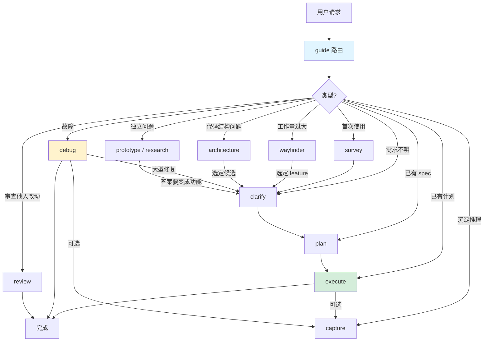

# Coding Skills

极简 coding agent 技能集,专注清晰流程和本地化开发。基于 Superpowers 和 Matt Pocock Skills 提炼。

**核心原则**: 完全本地化开发,不依赖 issue tracker (GitHub/Linear/Jira)。所有设计、计划、任务管理使用本地文件。

## 快速开始

安装后,在项目中执行:

```bash
# 1. 勘察项目(首次使用,或项目事实过期时)
/survey

# 2. 开始第一个功能
让我们添加用户登录功能
```

`guide` 把请求路由到合适的技能;每个技能产出文档或代码后停下,等你确认再进入下一步:

1. `clarify` 澄清需求,批准后保存并提交 `spec.md`
2. `plan` 拆分任务,呈现草稿,批准后保存并提交 `plan.md`
3. `execute` 按 TDD 逐个任务实现、评审、提交,最后由你决定合并还是保留分支

## 核心流程



## 技能速查

| 技能 | 触发时机 | 产物 | 示例 |
|------|---------|------|------|
| **guide** | 任何请求 | 路由决策 | "添加登录" → clarify |
| **survey** | 首次使用,或项目事实过期 | AGENTS.md、GLOSSARY.md | 项目事实:栈/命令/约定 |
| **clarify** | 需求不明 | spec.md(Spike 路径为 spike.md) | Spike/Bounded/Architectural 三路径 |
| **plan** | spec 已批准 | 分三档:Direct/Brief 只留在会话,Full 产出 plan.md + task briefs | 拆分为 tracer bullet 任务 |
| **execute** | 计划就绪 | commits + progress.md | RED→GREEN→REFACTOR 循环;传 `auto` 则单次批准跑完所有任务 |
| **debug** | 报告故障 | 诊断 + 回归测试 + 修复提交 | 4 阶段:根因调查→模式分析→假设验证→实施 |
| **review** | 分支审查（本地） | Standards + Spec + Learnings 三轴报告(`.cartoons/`) | Fowler smells + spec 对照 + 已记录陷阱;修复需你同意 |
| **wayfinder** | 大型跨模块工作 | initiative(charter + index + feature stubs) | 多会话协作 |
| **prototype** | 独立问题用代码回答 | 抛弃式原型(项目外;外观型改现有页面时用一次性分支) | 逻辑型 / 外观型 |
| **research** | 独立问题用资料回答 | `docs/research/` 带引用报告 | 库对比/最佳实践 |
| **architecture** | 代码结构拖累修改、模块过浅、难测试 | 改进候选清单(`.cartoons/` 临时报告) | 删除测试判断深/浅模块 |
| **capture** | 功能/修复/原型刚结束,推理过程会被丢掉 | `docs/learnings/` 单主题文件 | 反事实门槛筛掉可推断的内容 |

## 关键概念

### 文档结构

每个功能使用日期前缀的目录名:

```
/
├── docs/
│   ├── features/                        # 功能规格与计划(永久)
│   │   ├── 2025-01-15-user-auth/
│   │   │   ├── spec.md                 # 批准的规格
│   │   │   └── plan.md                 # 任务索引
│   │   └── 2025-01-20-cart-checkout/
│   │       ├── spec.md
│   │       └── plan.md
│   ├── initiatives/                     # 多功能规划(永久,wayfinder 产出:charter 总纲 + index 索引 + feature stubs)
│   ├── research/                        # 调研报告(永久,research 产出)
│   ├── learnings/                       # 会话推理沉淀(永久,capture 产出)
│   └── adr/                             # 架构决策记录(惰性创建)
├── .cartoons/                           # 临时,不提交
│   ├── 2025-01-15-user-auth/
│   │   ├── impl/
│   │   │   ├── progress.md             # 执行账本
│   │   │   ├── task-1.md               # 任务详细说明
│   │   │   └── task-2.md
│   │   └── review-a1b2c3d.md           # review 报告
│   └── architecture/
│       └── architecture-2025-01-15-billing.md  # architecture 报告
├── GLOSSARY.md                          # 术语表(惰性创建)
└── AGENTS.md                            # 项目事实
```

### 三层结构

1. **spec** — 问题/目标/范围/方案/约束/验收条件/测试入口
2. **plan** — 有序任务列表,每个任务有依赖声明
3. **task** — 独立可测试单元,有:
   - 明确交付物
   - 验证命令
   - Produces/Consumes 接口声明
   - 文件清单

### TDD 红-绿-重构循环

`execute`、`debug`、`review` 共用一份 `tdd.md`:
1. **RED** — 写失败测试
2. **GREEN** — 最小代码通过
3. **REFACTOR** — 清理重复

只测 spec 里批准过的测试入口(test entry point);回归测试要验证"还原修复后必须变红"。

### Tracer bullet 任务

垂直切片优先于水平分层:
- ✅ "用户点登录 → JWT 签发 → 仪表板渲染"
- ❌ "实现所有 models" + "写所有 routes"

### Domain Modeling

- **GLOSSARY.md** — 术语表,共享语言
- **ADR** — 架构决策记录(难逆转 + 令人意外 + 有权衡)
- 内联更新 — 术语确定时立即写入

### 提交责任

写文档的技能自己提交:survey(AGENTS/GLOSSARY)、clarify(spec/spike)、plan(plan.md)、wayfinder(charter/index/stubs)、research(报告)、execute/debug(代码)。都不 push。prototype 不提交,review 报告留在 `.cartoons/`。

## 何时用什么

```
简单改动(已知范围)
  → execute

需求不明
  → clarify (Spike/Bounded/Architectural)
    → Spike: 探索可行性
    → Bounded: 局部小改
    → Architectural: 跨模块/接口

多步骤工作
  → plan (按体量选输出档)
    → Direct: 1-2 文件、无行为变更 → 只写在会话里,同一会话内接 execute
    → Brief: ≤5 文件、单模块 → 任务列表写在会话里,同上
    → Full: 其它 → plan.md + task briefs
  → execute (逐任务停下确认)
    → 传 auto: 单次批准跑完所有任务(遇测试失败/规格歧义/高风险仍自动停下)

有 bug
  → debug (4 阶段循环)

需要审查他人改动
  → review (Standards + Spec + Learnings)

大型工作(跨多模块)
  → wayfinder (拆分 initiative)

独立问题(不阻塞某个功能)
  → prototype(用代码回答)/ research(用资料回答)

代码结构拖累修改
  → architecture (改进候选)

改动完成
  → finish(保留 / 本地合并 / 丢弃)

改动结束后,想留下推理过程
  → capture (docs/learnings/,可选)
```

## 示例场景

### 场景 1: 添加简单功能

```
用户: "添加用户头像上传"

→ guide 路由到 clarify
→ clarify 问 2-3 个问题(格式?存储?尺寸限制?)
→ 呈现 spec,用户批准
→ 保存并提交 docs/features/2025-01-20-avatar-upload/spec.md,停下
→ 用户确认后调用 plan
→ 拆分为 3 个 task:
  1. 上传 API endpoint
  2. 图片处理和存储
  3. 前端表单集成
→ 呈现计划草稿,用户批准
→ 保存并提交 plan.md,task briefs 写入 impl/(不提交),停下
→ 用户确认后调用 execute
→ 依次完成 3 个 task,每个 TDD + review + commit
→ 完成,报告证据,由你决定保留分支还是本地合并
```

### 场景 2: Bug 修复

```
用户: "购物车总价计算错了"

→ guide 路由到 debug
→ Phase 1: 根因调查(建一条秒级、确定、可无人值守的复现命令)
→ Phase 2: 模式分析(对比同类正常代码,列出全部差异)
→ Phase 3: 假设验证("若 X 是原因,改 Y 会让 bug 消失",先排序再验)
→ Phase 4: 实施
  - 按 tdd.md 写失败测试
  - 最小修复
  - 通过后临时还原修复,确认测试变红,再恢复
  - 只暂存本次文件后提交
→ 小修复到此为止,不进入 plan/execute
```

### 场景 3: 大型跨模块工作

```
用户: "这个工作太大,跨前端、后端、CI"

→ guide 路由到 wayfinder
→ 识别边界: frontend app, backend API, CI pipeline
→ 起草 charter(问题/目标/范围/约束/证据),用户批准
→ 定义 3 个 features,呈现草稿,用户批准后创建 charter + index + stubs
→ 用户选 feature-1: frontend
→ 读 feature-1 stub,调用 clarify 写出该 feature 的 spec(stub 里回填 spec 路径)
→ 然后 plan → execute
→ 重复,直到 3 个 features 都完成
```

## 与参考材料的差异

| 特性 | 本项目 | Superpowers | Matt Pocock Skills |
|------|--------|-------------|-------------------|
| 定位 | 极简本地开发 | 完整开发流程 | 工程基础技能集 |
| 语言 | 技能英文,README 中文 | 英文 | 英文 |
| subagent | 只读调研与审查,不并行写代码 | 每个 task 一个实现 subagent,串行,不并行实现 | `implement-spec` 并行实现 ticket |
| issue tracker | 无,全部用本地文件 | 无;收尾阶段可推送并创建 PR | 支持 GitHub/GitLab/本地,其他以自由文本记录 |
| worktree | 不使用 | 核心机制,开工前隔离工作区 | 仅 `implement-spec` 每个 ticket 一个 worktree |
| 流程 | 按需路由,逐步确认 | brainstorm → worktree → plan → 执行 → 收尾 | grill → spec → ticket → implement |
| TDD | 有测试工具时强制 RED-GREEN-REFACTOR;`execute`/`debug`/`review` 共用一份 reference | 强制(无失败测试不写生产代码) | `tdd` 作为参考技能,由 `implement` 驱动 |
| 提交 | 产出文档的技能自己提交,不 push | 收尾阶段由用户决定推送/PR | 由 tracker 与 `/pr` 决定 |
| 收尾 | `execute/finish.md`:保留 / 本地合并 / 丢弃 | worktree + 三种选项 + PR | draft PR 转 ready |
| domain modeling | `clarify` 的 reference:术语表 + ADR | 无 | 核心技能 `domain-modeling` |

## 故障排查

### 技能没触发

技能都需要用户显式调用(`/技能名`)。没有指名技能时,调用 `guide` 由它路由;路由规则见 `skills/guide/SKILL.md`。

### subagent 不可用

subagent 仅用于只读调研。运行环境没有委派机制时,技能会退化为在主进程内联探索,不影响结果。

### 术语不一致

运行 `survey`,创建 `GLOSSARY.md`。在 clarify 阶段主动建模。

### plan 任务顺序错

检查 `plan.md` 的任务列表和每个 task brief 的 `Depends on` / `Interfaces`(Consumes/Produces)声明。

### task brief 丢了(`.cartoons/` 被清掉)

`execute` 会按 spec.md 和 plan.md 就地重建 brief,并在账本里写 `brief rebuilt from plan.md`;plan 太薄重建不出来时会停下来让你重跑 `plan`。

### execute 跳过 TDD

检查项目是否有测试工具。`execute` 引用 `tdd.md` 执行 RED-GREEN-REFACTOR,配置/文档文件用最强可用检查。

### 会不会自动删东西?

**文档一律不删**:`spec.md`/`spike.md`、`plan.md`、`AGENTS.md`、`GLOSSARY.md`、ADR、`.cartoons/` 里的账本和 task brief、review 与 research 报告,看起来过期也是留下(或由新文档取代),由你决定它离不离开磁盘。

**不是文档的临时物照常清理**:调试探针和日志、项目外的抛弃式原型,以及你明确要求丢弃的分支(包括 `prototype/<name>` 一次性分支和 `finish` 里选择丢弃的分支)。

### design 还是 spec?

本套统一用 **spec**:产物是 `spec.md`。`design question`(prototype 要回答的问题)、ADR 的 `design decision`、`task design` 这些说法保留原样,指的是别的东西。

## 版本和更新

本技能集基于两个参考体系提炼:

- **Superpowers** (obra) — 完整流程管理,subagent 驱动开发
- **Matt Pocock Skills** — 工程基础,语言对齐(domain modeling + GLOSSARY.md)

当前版本专注本地化开发,极简流程,直线推进。

## 许可

MIT License
