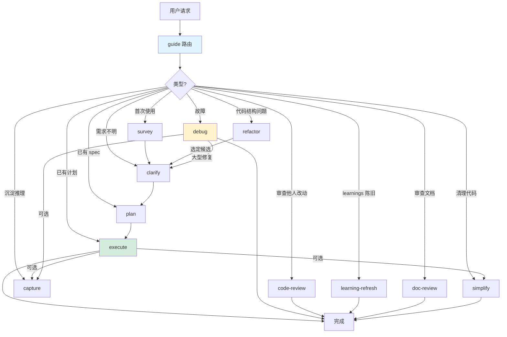

# Coding Skills

[](https://skills.sh/iron6909/coding-skills)

极简 coding agent 技能集,专注清晰流程和本地化开发。基于 Superpowers 和 Matt Pocock Skills 提炼。

**核心原则**: 完全本地化开发,不依赖 issue tracker (GitHub/Linear/Jira)。所有设计、计划、任务管理使用本地文件。

## 安装

### 通过 skills.sh 安装（推荐）

```bash
npx skills@latest add iron6909/coding-skills
```

选择你需要的技能，安装器会将它们复制到项目的 `.claude/skills/` 目录。

### 手动安装

克隆此仓库，将 `skills/` 目录下的技能复制到你的项目 `.claude/skills/` 目录。

## 快速开始

安装后,在项目中执行:

```bash
# 1. 勘察项目(首次使用,或项目事实过期时)
/survey

# 2. 开始第一个功能
让我们添加用户登录功能
```

`guide` 把请求路由到合适的技能;每个技能产出文档或代码后停下,等你确认再进入下一步:

1. `clarify` 澄清需求,批准后保存并提交 `spec.md`
2. `plan` 拆分任务,呈现草稿,批准后保存并提交 `plan.md`
3. `execute` 按 TDD 逐个任务实现、评审、提交,最后由你决定合并还是保留分支

## 核心流程


```mermaid
graph TD
    A[用户请求] --> B[guide 路由]
    B --> C{类型?}
    C -->|首次使用| D[survey]
    C -->|需求不明| E[clarify]
    C -->|已有 spec| F[plan]
    C -->|已有计划| G[execute]
    C -->|故障| H[debug]
    C -->|审查他人改动| I[code-review]
    C -->|代码结构问题| M[refactor]
    C -->|沉淀推理| N[capture]
    C -->|learnings 陈旧| O[learning-refresh]
    C -->|审查文档| P[doc-review]
    C -->|清理代码| Q[simplify]

    D --> E
    E --> F
    F --> G
    G --> J[完成]
    H --> J
    I --> J
    M -->|选定候选| E
    H -->|大型修复| E
    G -->|可选| N
    H -->|可选| N
    G -->|可选| Q
    O --> J
    P --> J
    Q --> J

    style B fill:#e1f5ff
    style G fill:#d4edda
    style H fill:#fff3cd
```

## 技能速查

| 技能 | 触发时机 | 产物 | 示例 |
|------|---------|------|------|
| **guide** | 任何请求 | 路由决策 | "添加登录" → clarify |
| **survey** | 首次使用,或项目事实过期 | AGENTS.md、GLOSSARY.md | 项目事实:栈/命令/约定 |
| **ideate** | 不确定如何实现,需对比技术方案 | `.cartoons/ideation/YYYYMMDD-HHMM-<topic>.md` | 生成2-3个方案,压力测试,推荐 |
| **clarify** | 需求不明 | spec.md/capability-map.md | 两路径:Bounded/Architectural;自动检测分解;Phase 1 可选 research/spike |
| **ui-design** | spec 涉及前端界面,需设计规格 | DESIGN.md + ui-spec.md | 建立设计系统、线框图、组件状态、交互流程 |
| **plan** | spec 已批准 | 分两档:Brief 只留在会话,Full 产出 plan.md + task briefs | 拆分为 tracer bullet 任务 |
| **execute** | 计划就绪 | commits + progress.md | RED→GREEN→REFACTOR 循环;传 `auto` 则单次批准跑完所有任务 |
| **ui-review** | 审查已实现的前端界面 | `.cartoons/ui-review/YYYYMMDD-HHMM.md` | 5 维度:一致性/可用性/可访问性/响应式/性能 |
| **debug** | 报告故障 | 诊断 + 回归测试 + 修复提交 | 4 阶段:根因调查→模式分析→假设验证→实施 |
| **optimize** | 系统性性能优化 | 优化代码提交 + `.cartoons/optimize/YYYYMMDD-HHMM/` | Profile→归因→测试变体→停止标准 |
| **code-review** | 分支审查（本地） | Standards + Spec + Learnings 三轴报告(`.cartoons/review/`) | Fowler smells + spec 对照 + 已记录陷阱;修复需你同意 |
| **commit** | 临时改动需提交 | 单次提交（不 push） | 检测约定,暂存指定文件,写优质提交信息 |
| **autoflow** | 全自动端到端执行 | 完整交付:spec/plan/commits/review 修复 | 单次批准,最少检查点 |
| **refactor** | 代码结构拖累修改、模块过浅、难测试、已选定目标 | 改进候选清单(`.cartoons/refactor/YYYYMMDD-<scope>.md`) | 删除测试判断深/浅模块 |
| **capture** | 功能/修复刚结束,推理过程会被丢掉 | `docs/learnings/YYYYMMDD-<topic>.md` | 反事实门槛筛掉可推断的内容 |
| **learning-refresh** | learnings 与代码库漂移 | 更新/合并/删除 learnings,提交改动 | 审计 `docs/learnings/` 陈旧条目 |
| **doc-review** | 审查规划文档 | 原地编辑 + 报告,提交修复 | spec/plan/capability-map 完整性/可行性检查 |
| **simplify** | 代码能跑但该清理 | 提交简化后代码 | 提取重复逻辑、改进命名、优化效率 |
| **handoff** | 暂停工作,跨会话继续 | `.cartoons/handoff/YYYYMMDD-HHMM.md` | 记录阶段/已完成/阻塞点/下一步 |

## 关键概念

### 文档结构

每个功能使用日期前缀的目录名:

```
/
├── docs/
│   ├── features/                        # 功能规格与计划（永久）
│   │   ├── 20250115-user-auth/
│   │   │   ├── spec.md                 # 批准的规格
│   │   │   └── plan.md                 # 任务索引
│   │   ├── 20250120-cart-checkout/
│   │   │   ├── spec.md
│   │   │   └── plan.md
│   │   └── 20250125-platform-refactor/
│   │       └── capability-map.md       # 多模块拆分（clarify 自动检测生成）
│   ├── learnings/                       # 会话推理沉淀（永久，capture 产出）
│   │   └── 20250115-jwt-security.md    # 单主题学习文档
│   └── adr/                             # 架构决策记录（惰性创建）
├── .cartoons/                           # 临时，不提交（按技能组织）
│   ├── features/                        # feature 相关
│   │   └── 20250115-user-auth/
│   │       ├── impl/
│   │       │   ├── progress.md         # 执行账本
│   │       │   ├── task-1.md           # 任务详细说明
│   │       │   └── task-2.md
│   │       └── review-20250115-1430.md # feature 内的 code-review
│   ├── handoff/                         # 会话交接
│   │   ├── 20250115-1430.md            # 通用交接
│   │   └── 20250115-1430-user-auth.md  # 带主题的交接
│   ├── ideation/                        # 想法生成
│   │   └── 20250120-1530-realtime-sync.md
│   ├── optimize/                        # 性能优化实验
│   │   └── 20250115-1430/
│   │       ├── baseline.md             # 基线 profile
│   │       ├── variant-1.md            # 变体测试结果
│   │       └── summary.md              # 最终报告
│   ├── refactor/                        # 重构报告
│   │   └── 20250115-billing.md
│   └── review/                          # 独立 code-review
│       └── 20250115-1430-security.md
├── GLOSSARY.md                          # 术语表（惰性创建）
└── AGENTS.md                            # 项目事实
```

### 三层结构

1. **spec** — 问题/目标/范围/方案/约束/验收条件/测试入口
2. **plan** — 有序任务列表,每个任务有依赖声明
3. **task** — 独立可测试单元,有:
   - 明确交付物
   - 验证命令
   - Produces/Consumes 接口声明
   - 文件清单

### TDD 红-绿-重构循环

`execute`、`debug`、`code-review` 共用一份 `tdd.md`:
1. **RED** — 写失败测试
2. **GREEN** — 最小代码通过
3. **REFACTOR** — 清理重复

只测 spec 里批准过的测试入口(test entry point);回归测试要验证"还原修复后必须变红"。

### Tracer bullet 任务

垂直切片优先于水平分层:
- ✅ "用户点登录 → JWT 签发 → 仪表板渲染"
- ❌ "实现所有 models" + "写所有 routes"

### Domain Modeling

- **GLOSSARY.md** — 术语表,共享语言
- **ADR** — 架构决策记录(难逆转 + 令人意外 + 有权衡)
- 内联更新 — 术语确定时立即写入

### 提交责任

写文档的技能自己提交:survey(AGENTS/GLOSSARY)、clarify(spec/spike/capability-map)、plan(plan.md)、capture(learnings)、execute/debug(代码)。都不 push。code-review 报告留在 `.cartoons/review/`。

## 何时用什么

```
简单改动(已知范围)
  → execute

需求不明
  → clarify (Spike/Bounded/Architectural)
    → Spike: 探索可行性
    → Bounded: 局部小改
    → Architectural: 跨模块/接口

多步骤工作
  → plan (按体量选输出档)
    → Brief: ≤5 文件、单模块 → 任务列表写在会话里,同一会话内接 execute
    → Full: 其它 → plan.md + task briefs
  → execute (逐任务停下确认)
    → 传 auto: 单次批准跑完所有任务(遇测试失败/规格歧义/高风险仍自动停下)

有 bug
  → debug (4 阶段循环)

需要审查他人改动
  → code-review (Standards + Spec + Learnings)

多模块大型工作
  → clarify (自动检测并生成 capability-map.md)

代码结构拖累修改
  → refactor (改进候选)

改动完成
  → finish(保留 / 本地合并 / 丢弃)

改动结束后,想留下推理过程
  → capture (docs/learnings/,可选)

learnings 与代码库漂移
  → learning-refresh (审计并刷新 docs/learnings/)

审查规划文档
  → doc-review (spec/plan/charter 完整性检查)

代码能跑但该清理
  → simplify (提取重复、改进命名、优化效率)
```

## 示例场景

### 场景 1: 添加简单功能

```
用户: "添加用户头像上传"

→ guide 路由到 clarify
→ clarify 问 2-3 个问题(格式?存储?尺寸限制?)
→ 呈现 spec,用户批准
→ 保存并提交 docs/features/2025-01-20-avatar-upload/spec.md,停下
→ 用户确认后调用 plan
→ 拆分为 3 个 task:
  1. 上传 API endpoint
  2. 图片处理和存储
  3. 前端表单集成
→ 呈现计划草稿,用户批准
→ 保存并提交 plan.md,task briefs 写入 impl/(不提交),停下
→ 用户确认后调用 execute
→ 依次完成 3 个 task,每个 TDD + code-review + commit
→ 完成,报告证据,由你决定保留分支还是本地合并
```

### 场景 2: Bug 修复

```
用户: "购物车总价计算错了"

→ guide 路由到 debug
→ Phase 1: 根因调查(建一条秒级、确定、可无人值守的复现命令)
→ Phase 2: 模式分析(对比同类正常代码,列出全部差异)
→ Phase 3: 假设验证("若 X 是原因,改 Y 会让 bug 消失",先排序再验)
→ Phase 4: 实施
  - 按 tdd.md 写失败测试
  - 最小修复
  - 通过后临时还原修复,确认测试变红,再恢复
  - 只暂存本次文件后提交
→ 小修复到此为止,不进入 plan/execute
```

### 场景 3: 大型跨模块工作

```
用户: "这个工作太大,跨前端、后端、CI"

→ guide 路由到 clarify (Bounded/Architectural 中选一个)
→ 选 Architectural（跨多模块）
→ Phase 1 Step 1: 读代码、read GLOSSARY/AGENTS
→ Phase 1 Step 1.5 [自动检测]: 发现需要拆分成 3 个独立能力
  - frontend app
  - backend API  
  - CI pipeline
→ 生成 capability-map.md,用户批准
→ 用户选第一个模块: frontend
→ 为该模块调用 clarify (Bounded 或 Architectural) 写出 spec.md
→ 然后 plan → execute
→ 重复,直到所有模块都完成
```

## 与参考材料的差异

| 特性 | 本项目 | Superpowers | Matt Pocock Skills |
|------|--------|-------------|-------------------|
| 定位 | 极简本地开发 | 完整开发流程 | 工程基础技能集 |
| 语言 | 技能英文,README 中文 | 英文 | 英文 |
| subagent | 只读调研与审查,不并行写代码 | 每个 task 一个实现 subagent,串行,不并行实现 | `implement-spec` 并行实现 ticket |
| issue tracker | 无,全部用本地文件 | 无;收尾阶段可推送并创建 PR | 支持 GitHub/GitLab/本地,其他以自由文本记录 |
| worktree | 不使用 | 核心机制,开工前隔离工作区 | 仅 `implement-spec` 每个 ticket 一个 worktree |
| 流程 | 按需路由,逐步确认 | brainstorm → worktree → plan → 执行 → 收尾 | grill → spec → ticket → implement |
| TDD | 有测试工具时强制 RED-GREEN-REFACTOR;`execute`/`debug`/`code-review` 共用一份 reference | 强制(无失败测试不写生产代码) | `tdd` 作为参考技能,由 `implement` 驱动 |
| 提交 | 产出文档的技能自己提交,不 push | 收尾阶段由用户决定推送/PR | 由 tracker 与 `/pr` 决定 |
| 收尾 | `execute/finish.md`:保留 / 本地合并 / 丢弃 | worktree + 三种选项 + PR | draft PR 转 ready |
| domain modeling | `clarify` 的 reference:术语表 + ADR | 无 | 核心技能 `domain-modeling` |

## 故障排查

### 技能没触发

技能都需要用户显式调用(`/技能名`)。没有指名技能时,调用 `guide` 由它路由;路由规则见 `skills/guide/SKILL.md`。

### subagent 不可用

subagent 仅用于只读调研。运行环境没有委派机制时,技能会退化为在主进程内联探索,不影响结果。

### 术语不一致

运行 `survey`,创建 `GLOSSARY.md`。在 clarify 阶段主动建模。

### plan 任务顺序错

检查 `plan.md` 的任务列表和每个 task brief 的 `Depends on` / `Interfaces`(Consumes/Produces)声明。

### task brief 丢了(`.cartoons/` 被清掉)

`execute` 会按 spec.md 和 plan.md 就地重建 brief,并在账本里写 `brief rebuilt from plan.md`;plan 太薄重建不出来时会停下来让你重跑 `plan`。

### execute 跳过 TDD

检查项目是否有测试工具。`execute` 引用 `tdd.md` 执行 RED-GREEN-REFACTOR,配置/文档文件用最强可用检查。

### 会不会自动删东西?

**文档一律不删**:`spec.md`、`plan.md`、`AGENTS.md`、`GLOSSARY.md`、ADR、`.cartoons/` 里的账本和 task brief、review 报告,看起来过期也是留下(或由新文档取代),由你决定它离不离开磁盘。

**不是文档的临时物照常清理**:调试探针和日志、项目外的抛弃式原型,以及你明确要求丢弃的分支(包括 `prototype/<name>` 一次性分支和 `finish` 里选择丢弃的分支)。

### design 还是 spec?

本套统一用 **spec**:产物是 `spec.md`。`design question`(prototype 要回答的问题)、ADR 的 `design decision`、`task design` 这些说法保留原样,指的是别的东西。

## 版本和更新

本技能集基于两个参考体系提炼:

- **Superpowers** (obra) — 完整流程管理,subagent 驱动开发
- **Matt Pocock Skills** — 工程基础,语言对齐(domain modeling + GLOSSARY.md)

当前版本专注本地化开发,极简流程,直线推进。

## 许可

MIT License
