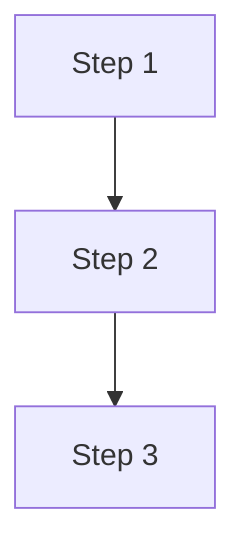

# Plan

Turn an approved `.cartoons/<semantic-name>/design.md` into an implementation plan. Save it beside the design as `plan.md`.

Do not write product code, create a worktree, create tickets, commit changes, or start implementation.

## Preconditions

Find the approved design before planning.

- Read the applicable `AGENTS.md` files.
- Read `.cartoons/<semantic-name>/design.md` in full.
- Confirm that the design states the problem, goal, scope, selected approach, constraints, acceptance conditions, and testing boundary.
- If the design is missing, still a draft, or contains unresolved decisions, stop and ask for clarification.

The design is the authority. Do not add new product decisions silently. Record a needed change in the design first, then plan from the updated design.

## Explore

Read only the code needed to make the plan precise:

- affected modules and their callers
- related tests and test helpers
- interfaces, schemas, configuration, and build rules
- existing patterns for similar behavior
- commands used to test, lint, build, and type-check the affected area

Use repository facts. Do not ask the user for facts that tools can find.

### Large code exploration

Read directly for small changes. Dispatch read-only subagents when the plan needs broad code exploration and retaining all source details in the main context could cause overflow.

Use subagents when one or more conditions apply:

- the design spans several independent modules or packages
- many callers, tests, interfaces, or configuration files need inspection
- separate frontend, backend, data, infrastructure, or tooling areas matter
- the main process would need to retain large file listings or reports

Split work by clear boundary. Give each subagent a narrow task, such as:

- map the affected module, callers, and existing seams
- inspect related tests and the repository's test commands
- inspect interfaces, configuration, generated paths, and build constraints

Request only:

- inspected boundary
- relevant files and symbols
- current behavior
- proposed task boundary supported by evidence
- commands and expected checks
- dependencies on other areas
- unknowns and conflicts
- evidence paths

Subagents must remain read-only. They must not ask the user questions, choose unresolved product behavior, write `.cartoons`, edit code, create branches or worktrees, or dispatch other agents. Do not copy full reports into the main context. Summarize only plan-relevant findings.

The main process owns decomposition and all writes. Keep these categories separate:

- repository fact
- design decision
- plan choice
- unresolved question

Treat conflicting findings as unresolved until repository evidence or an updated design settles them.

## Map the change

Before writing tasks, list the change map in working notes:

- files to create, modify, or delete
- responsibility of each file
- interfaces that tasks share
- tests that prove each acceptance condition
- commands that verify the affected area

Follow existing project boundaries. Do not include a refactor only because it looks cleaner. Include a refactor only when the design requires it or it makes the requested change safe.

If the design covers independent subsystems, split it into separate plans or state the dependency clearly. Each plan should produce a testable result.

## Step design

Make each step the smallest useful unit with its own check. A step may include setup, code, tests, and documentation when they form one deliverable.

Order steps by dependency:

1. prerequisites and shared interfaces
2. core behavior
3. integration and user-facing behavior
4. error paths and compatibility cases
5. final verification

Prefer vertical slices that can run and be checked on their own. Do not make separate steps for every layer when one slice can prove the behavior.

Each action does one thing and has a checkable result. Use a test-first order when the project supports it:

1. write the test or verification case
2. run it and record the expected failure when applicable
3. implement the smallest change
4. run the focused check
5. run the broader affected check

Do not require a failing test when the repository has no test harness or when the work is documentation or configuration only. Name the available check instead.

## Step briefs

After writing `plan.md`, generate a brief for each step:

```text
.cartoons/<semantic-name>/impl/task-<N>.md
```

Each brief contains only what that task needs:

```markdown
# Task <N>: <short name>

**Base:** <commit that this task branches from>

**Depends on:** <task numbers or None>

**Produces:** <interface or behavior later tasks use>

## Steps

- [ ] Step 1: <one action>
  - Check: `<command>` → <expected result>
- [ ] Step 2: <one action>
  - Check: `<command>` → <expected result>

## Files

- Create: `<exact path>` — <responsibility>
- Modify: `<exact path>` — <responsibility>
- Test: `<exact path>` — <coverage>

## Interfaces

**Consumes from Task <M>:**
- <interface or value>

**Produces for Task <P>:**
- <interface or value>
```

Briefs let execute read task context without loading the full plan.

## Plan format

Create `.cartoons/<semantic-name>/plan.md` as a lightweight index:

```markdown
# <Feature name> Implementation Plan

**Goal:** <one sentence>

**Design:** `.cartoons/<semantic-name>/design.md`

**Approach:** <two or three sentences>

**Constraints:**

- <exact constraint>

**Review focus:**

- <important failure mode and the check that covers it>

## Steps

1. Step 1: <short name> — depends on: None — produces: <interface>
2. Step 2: <short name> — depends on: Step 1 — produces: <interface>
3. Step 3: <short name> — depends on: Step 2 — produces: <interface>

## Dependency graph



## Final verification

- [ ] Run: `<focused command>` → <expected result>
- [ ] Run: `<broader command>` → <expected result>
```

Omit empty sections. Use exact names and values supported by repository evidence. Do not invent line numbers.

plan.md is an index. Step details live in `impl/step-N.md` files. Keep plan.md under 100 lines.

## Self-review

Before reporting the plan, check it against the design:

- every design requirement maps to a step or final check
- every step has one clear deliverable
- step order respects dependencies
- shared interfaces use the same names and types everywhere
- each acceptance condition has an observable check
- error, empty, boundary, and compatibility cases are covered when relevant
- commands work from the repository root
- no step contains an unresolved product decision
- no action is vague or combines unrelated changes
- the plan does not add unrequested work, dependencies, or refactors

Fix the plan before reporting it. If a gap requires a product decision, stop and update the design instead.

## Finish

After saving plan and briefs, report:

```text
Plan saved: .cartoons/<semantic-name>/plan.md
Step briefs: .cartoons/<semantic-name>/impl/step-*.md (<N> steps)
Next: execute
```

Stop after saving the plan. Do not automatically invoke `execute` or modify product files.
